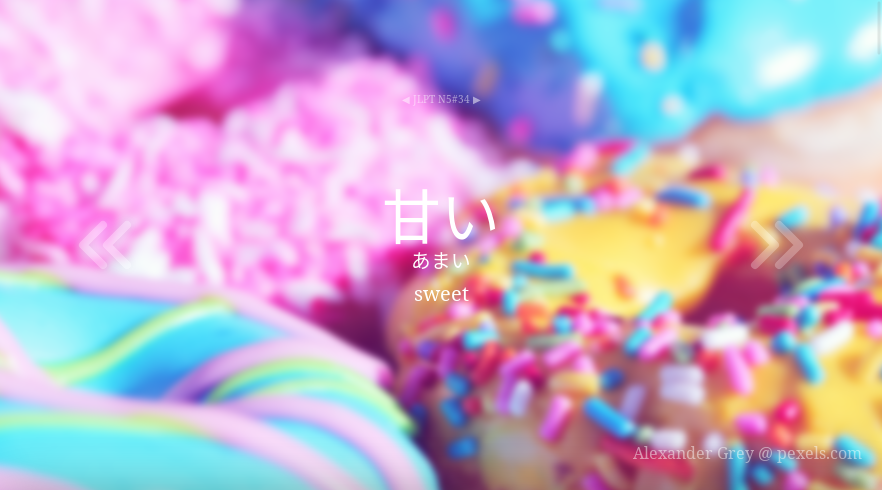
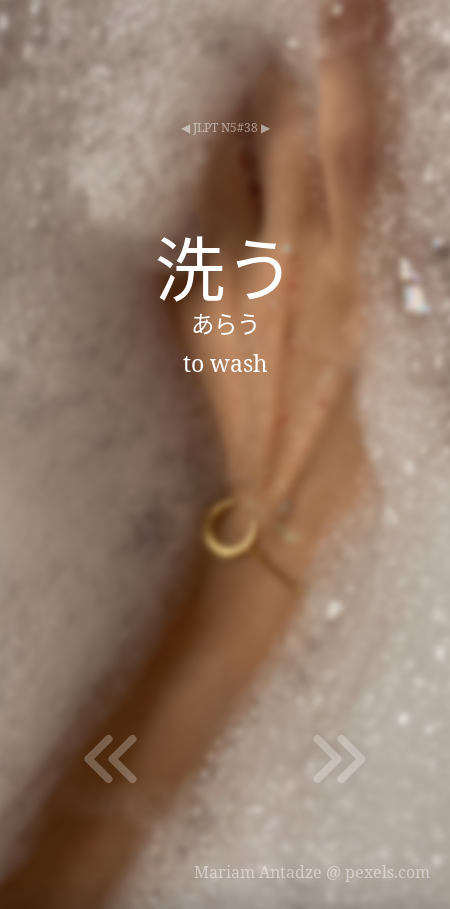
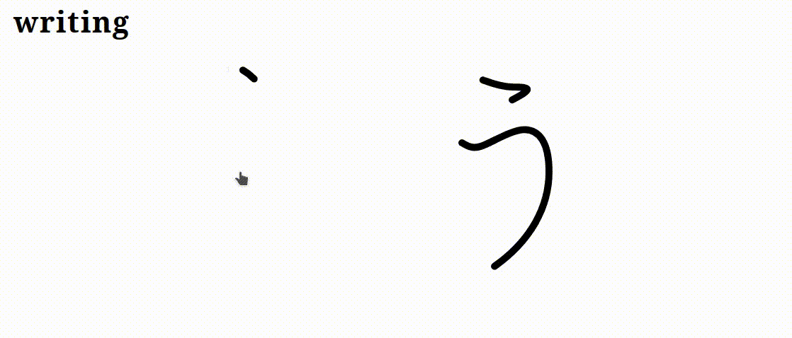
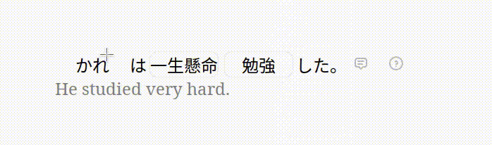

 

# DailyNihongo
DailyNihongo is a website for Japanese language learners that provides a new word every day. The word lists were compiled from various resources and are split by the JLPT level. While this way of division might not be the best, it still separetes the most common words from the rarely-used ones. Currently *N5* and *N4* levels are supported.

     
    

# Writing
Writing uses a custom player to process and make data from KanjiVG easily readable. It helps you remember the stroke order and shows replayable speed-adjusted animations.

    

# Sentences
Sentences make understanding a certain word easier. Thanks to the Tatoeba API, approx. 10 sentences are provided for every piece of vocab.

    

# Contributing
Good luck! I doubt that anyone is going to contribute to this project, but feel free to do so. The JS code is a total mess and it all barely works

# TODOs
- [ ] dark theme
- [ ] direct usage of Tatoeba API (they need to change a header on their server...)
- [ ] optimization 

# Sources
+ webpage designed & created by [@bajtix](https://github.com/Bajtix)
+ uses [KanjiVG](https://github.com/KanjiVG/kanjivg) for character writings, [Tatoeba](https://tatoeba.org/en) for sentence search and [Pexels](https://www.pexels.com/) for background photos
+ source code contains materials from [KanjiDatabase](https://www.kanjidatabase.com/) which are currently unused
+ word lists were compiled from various web resources

# License
Licensed under GPLv3 (note that the referenced projects' licenses apply)